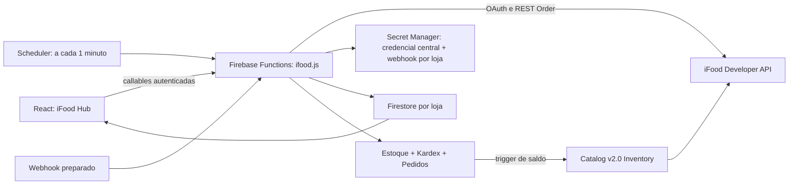
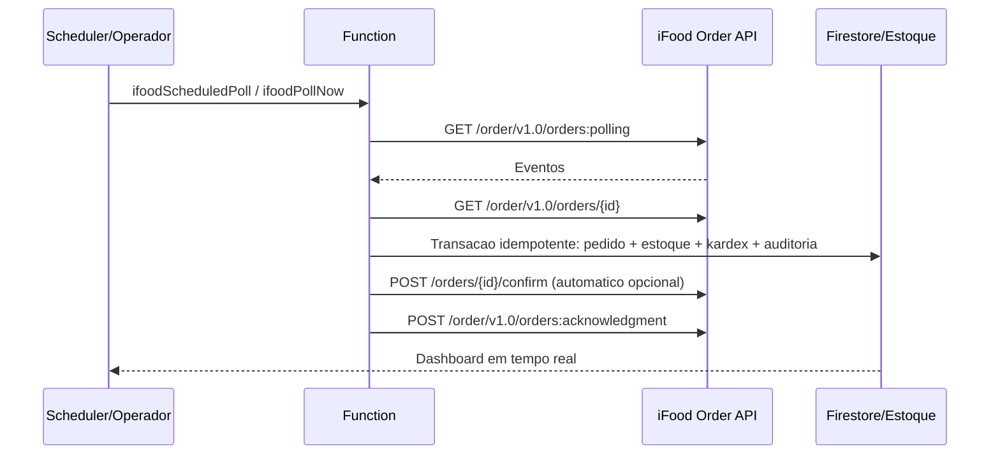

# iFood Hub - Integracao Operacional

## Objetivo

O `iFood Hub` torna a plataforma a fonte de verdade de estoque e operacao por loja. A credencial do aplicativo centralizado e protegida uma unica vez; cada loja possui apenas seu `Merchant ID`, configuracao operacional e mapeamentos. Pedidos do iFood alimentam pedidos internos, estoque, kardex, faturamento operacional, alertas e auditoria em tempo real.

O fluxo de pedidos foi implementado conforme a documentacao Order fornecida em `Documentacao Ifood.txt`: polling, acknowledgment, detalhes, confirmacao, inicio de preparo, pronto/dispatch, cancelamentos e `ORDER_PATCHED`.

## Arquitetura



## Modulos entregues

| Camada | Entrega |
| --- | --- |
| Frontend | Pagina `iFood Hub` com operacao, indicadores, alertas, catalogo/estoque, configuracao, auditoria e dark mode |
| Credenciais | Client ID e Client Secret centrais no Secret Manager; segredo futuro de webhook isolado por loja |
| Pedidos | Polling manual e agendado, detalhe do pedido, acknowledgment apos processamento, idempotencia por evento |
| Ciclo operacional | Comandos `confirm`, `startPreparation`, `readyToPickup`, `dispatch`, cancelamento e validacao de codigos |
| Catalogo e estoque | Publicacao em lote, preco iFood independente, codigo PDV automatico, importacao de existentes, baixa/estorno e inventario oficial |
| Resiliencia | Retry exponencial para REST/rate limit, token em cache, alertas, health status e nova tentativa de estoque |
| Seguranca | Escritas iFood restritas a Functions pelas regras; segredos fora do Firestore; separacao por loja |
| Evolucao | Endpoint HTTP para webhook ja isolado, ativavel apos homologacao do contrato iFood |

## Fluxo de pedido



Regras operacionais:

1. Eventos so recebem acknowledgment depois que foram persistidos sem erro.
2. Um `eventId` ja processado nao baixa estoque novamente.
3. `PLACED` pode acionar confirmacao automatica; `CONFIRMED` pode iniciar preparo automaticamente.
4. `ORDER_PATCHED` atualiza detalhes sem transformar um pedido em pendente.
5. `CANCELLED` estorna o saldo anteriormente consumido.
6. Falta de mapeamento ou estoque insuficiente cria alerta e impede acknowledgment para permitir recuperacao.
7. `CONCLUDED` e recebido como evento: conforme a API Order, o iFood conclui o pedido automaticamente e nao oferece comando de conclusao.
8. Detalhes ainda indisponiveis recebem backoff e novo polling; apos 10 minutos sem detalhe, o evento entra em dead-letter auditavel para impedir loop infinito.

## Estoque e catalogo

O saldo principal permanece em `lojas/{lojaId}/produtos/{productId}.estoque`. Ao receber venda iFood, a transacao baixa produto e `estoque`, registra `kardex` e atualiza o pedido interno. Ao ocorrer venda interna, o trigger `ifoodProductStockChanged` publica o novo saldo do produto mapeado.

Cada produto pode armazenar `precoIfood`, independente de `preco`. Em `Catalogo e estoque`, a operacao publica um produto ou um lote usando `PUT /catalog/v2.0/merchants/{merchantId}/items`. Para novos itens, a plataforma gera UUIDs v4 estaveis e um `externalCode`/Codigo PDV no formato `AGD_<id interno>`; novas publicacoes reutilizam os mesmos identificadores para atualizar o item, sem duplicacao.

O processamento de pedidos segue Order; a publicacao de saldo usa a API oficial de Catalog v2.0. Para cada produto mapeado, a Function chama:

```http
POST /catalog/v2.0/merchants/{merchantId}/inventory
Authorization: Bearer <token>
Content-Type: application/json

{
  "productId": "<produto-mapeado-no-ifood>",
  "quantity": 5
}
```

`quantity: 0` limita a venda a zero; uma reposicao publica novamente o saldo positivo. Por seguranca da credencial central, os endpoints de autenticacao, catalogo e inventario sao fixados no backend para as rotas oficiais do iFood.

## Modelagem Firestore

Todas as colecoes abaixo ficam sob `lojas/{lojaId}`.

| Colecao/documento | Conteudo | Escrita |
| --- | --- | --- |
| `integrations/ifood` | Referencias protegidas para Client ID/Client Secret centrais do aplicativo | Function |
| `ifood/config` | Merchant ID, flags e webhook da loja; sem leitura direta do browser | Function |
| `ifoodHealth/status` | Status da API, latencia, ultimo polling/erro | Function |
| `ifoodOrders/{orderId}` | Espelho operacional do pedido, itens, status, alvo de estoque | Function |
| `ifoodEvents/{eventId}` | Idempotencia e payload auditavel do evento | Function |
| `ifoodCommands/{orderId_action}` | Idempotencia dos comandos automaticos confirm/preparation | Function |
| `ifoodProductMappings/{productId}` | Produto interno para item iFood, saldo publicado e falhas | Function |
| `ifoodAlerts/{alertId}` | Falhas de mapeamento, estoque, API e sincronizacao | Function |
| `ifoodAudit/{auditId}` | Polling, comandos e alteracoes operacionais | Function |
| `pedidos/ifood_{orderId}` | Pedido unificado com as vendas internas | Function |
| `kardex/ifood_*` | Movimento deterministico de baixa/estorno | Function |

## Functions e endpoints

| Function | Tipo | Uso |
| --- | --- | --- |
| `ifoodGetConfiguration` | Callable | Carregar configuracao publica e health |
| `ifoodSaveConfiguration` | Callable | Salvar configuracao e segredos por loja |
| `ifoodTestConnection` | Callable | Validar OAuth iFood |
| `ifoodLoadMerchants` | Callable | Listar lojas autorizadas pela credencial e preencher o Merchant ID |
| `ifoodPromoteStoredCredentials` | Callable | Migrar credencial antiga de uma loja para o uso central |
| `ifoodPollNow` | Callable | Consulta imediata de eventos |
| `ifoodOrderAction` | Callable | Confirmar, preparar, despachar, cancelar ou validar codigo |
| `ifoodGetCancellationReasons` | Callable | Buscar motivos de cancelamento validos antes da solicitacao |
| `ifoodLoadCatalogProducts` | Callable | Importar itens/produtos Catalog v2.0 para mapeamento |
| `ifoodPublishProducts` | Callable | Publicar/atualizar produtos internos em lote com preco iFood e Codigo PDV |
| `ifoodSaveProductMapping` | Callable | Vincular produto interno e item iFood |
| `ifoodSyncStockNow` | Callable | Reconciliar saldo manualmente |
| `ifoodScheduledPoll` | Scheduler | Polling automatico e retries de estoque |
| `ifoodProductStockChanged` | Firestore trigger | Propagar venda interna/reabastecimento |
| `ifoodWebhook` | HTTP | Receiver pronto para migracao de polling para webhook |

## Configuracao de producao

### Pre-requisitos iFood

1. Cadastre/aprove o aplicativo no portal iFood Developer para o merchant da loja.
2. Obtenha `Client ID` e `Client Secret` do aplicativo; cada merchant autorizado e localizado pela propria plataforma.
3. Solicite/habilite os modulos `Order` e `Catalog` necessarios; o estoque usa o endpoint de inventario Catalog v2.0.
4. Comece em homologacao se disponivel e somente depois habilite producao.

### Google Cloud e Firebase

1. Ative APIs:

```powershell
gcloud services enable secretmanager.googleapis.com cloudscheduler.googleapis.com cloudfunctions.googleapis.com run.googleapis.com --project crmdoceria-9959e
```

2. Como a plataforma cria e troca segredos automaticamente para novas lojas, obtenha a service account padrao das Functions de 2a geracao e autorize a gestao do Secret Manager:

```powershell
$PROJECT_ID = "crmdoceria-9959e"
$PROJECT_NUMBER = gcloud projects describe $PROJECT_ID --format="value(projectNumber)"
$FUNCTIONS_SA = "$PROJECT_NUMBER-compute@developer.gserviceaccount.com"
gcloud projects add-iam-policy-binding $PROJECT_ID `
  --member="serviceAccount:$FUNCTIONS_SA" `
  --role="roles/secretmanager.admin"
```

Em ambientes com service account customizada, substitua `$FUNCTIONS_SA` pela conta configurada no runtime. O papel `secretmanager.admin` e necessario para a automacao criar segredos e novas versoes; uma operacao que precrie todos os segredos pode reduzir esse papel depois.

3. Faca deploy do backend, regras e frontend:

```powershell
firebase deploy --only functions,firestore:rules,hosting --project crmdoceria-9959e
```

4. No CRM, escolha uma loja especifica e abra `iFood Hub > Configuracao`.
5. Na primeira loja, preencha `Client ID` e `Client Secret`. Ao salvar, a Function cria automaticamente a credencial central protegida; as demais lojas nao precisam repetir esses dados:

```text
ifood_platform_client_id
ifood_platform_client_secret
ifood_<lojaId>_webhook_secret   (somente quando informado)
```

6. Em cada loja cadastrada, clique em `Localizar lojas iFood`; a Function usa `GET /merchant/v1.0/merchants`, selecione a loja autorizada e salve o `Merchant ID`.
7. Marque `Integracao ativa`, `Polling automatico` e, quando apropriado, `Confirmar pedidos`.
8. Clique em `Testar conexao`; o selo da API deve ficar online.
9. Preencha `Preco iFood` no cadastro dos produtos e, em `Catalogo e estoque`, use `Publicar todos prontos` ou selecione itens individualmente.
10. Use `Vincular item ja cadastrado no iFood` apenas para itens existentes que nao devem ser recriados.
11. Clique em `Reconciliar estoque`; o backend utiliza automaticamente o inventario Catalog v2.0 oficial.

## Seguranca e operacao

- Cada callable valida usuario gestor e acesso a loja; nenhuma acao opera no seletor "todas as lojas".
- A credencial central permite onboarding de nova loja com somente a selecao do Merchant ID autorizado.
- Rotas de OAuth e Catalog nao podem ser editadas na interface; isso impede que um usuario redirecione tokens ou credenciais centrais.
- Segredos nunca retornam ao navegador; a tela recebe somente `credentialsReady`.
- A configuracao iFood com referencias a segredos nao possui leitura direta no browser; o painel a obtem somente por callable autorizado.
- Escritas nas colecoes iFood sao bloqueadas ao cliente e realizadas pelo Admin SDK.
- Os espelhos operacionais seguem a leitura autenticada atualmente usada pelos pedidos do CRM; mutacoes e configuracao exigem dono/gerente com acesso a loja.
- OAuth usa cache curto em memoria; resposta `401` renova token.
- Comandos automaticos possuem chave idempotente para permitir retry sem confirmar ou preparar duas vezes.
- `429`, timeouts e erros transitorios recebem retry com espera exponencial.
- Webhook exige segredo HMAC quando ativado; antes de ativar em producao, confirme com o iFood o header e formato oficial de assinatura.
- Alertas de falha devem ser acompanhados no painel e por monitoramento externo de Cloud Functions/Cloud Logging.

## Escalabilidade e roadmap

| Fase | Evolucao |
| --- | --- |
| Atual | Polling resiliente, painel real time, mapeamento, estoque transacional, Secret Manager e auditoria |
| Homologacao Catalog | Validar permissao Inventory para o app iFood e cobrir variacoes de payload por teste de contrato |
| Webhooks | Validar assinatura oficial, ativar receiver e manter polling como recuperacao/reconciliacao |
| Filas dedicadas | Migrar eventos e publicacoes de saldo para Cloud Tasks/Pub/Sub com DLQ por loja |
| Financeiro | Importar taxas/repasses iFood e conciliar venda, NF-e/NFC-e e recebimento |
| Observabilidade | Metric-based alerts para SLA, taxa de erro, atraso de polling, divergencia de estoque e SLO |

## Checklist de aceite

1. Credenciais de duas lojas geram segredos distintos e ambas autenticam.
2. Pedido `PLACED` aparece no painel, baixa estoque uma unica vez e cria kardex.
3. Reprocessar o mesmo evento nao altera estoque.
4. Venda interna publica novo saldo e saldo zero indisponibiliza o item via endpoint Catalog aprovado.
5. Cancelamento estorna estoque e registra auditoria.
6. `ORDER_PATCHED` atualiza o pedido sem perda de status.
7. Falha/rate limit aparece em alertas, e a reconciliacao tenta novamente.
8. Usuario sem permissao de gestor nao consegue executar callables iFood.

## Referencias oficiais

- [iFood Developer - Order Workflow](https://developer.ifood.com.br/pt-BR/docs/guides/order/workflow/)
- [iFood Developer - Order Endpoints](https://developer.ifood.com.br/pt-BR/docs/guides/modules/order/endpoints)
- [iFood Developer - Order Events](https://developer.ifood.com.br/en-US/docs/guides/modules/order/events/)
- [iFood Developer - Catalog v2.0 Endpoints](https://developer.ifood.com.br/pt-BR/docs/guides/modules/catalog/endpoints/)
